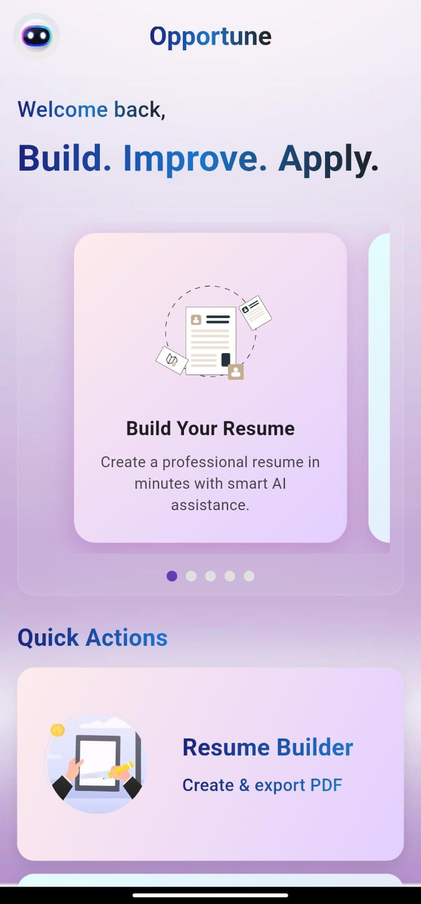
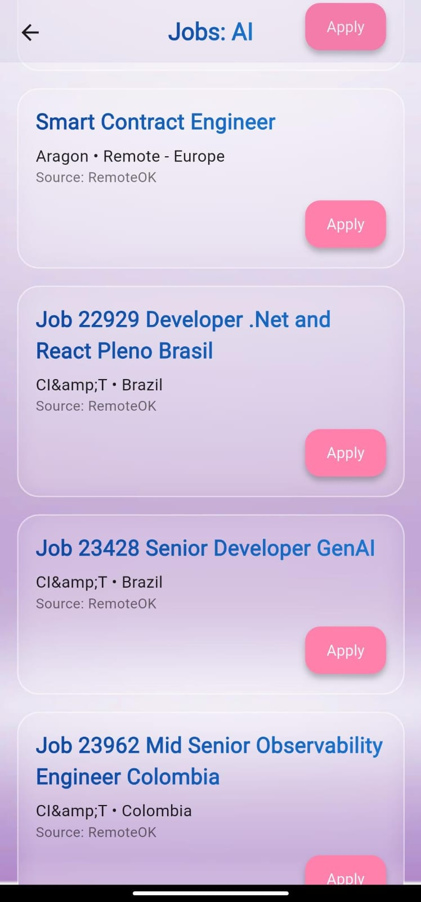

# 📱 Career Assistant App

An AI-powered mobile application built with **Flutter** and **Node.js backend**, designed to simplify the job search and career growth process.  
It helps users create professional resumes, analyze job descriptions, detect skill gaps, and even apply for jobs seamlessly. 🚀

---

## 📌 About the Project

Career Assistant is designed for job seekers who want a **smarter, faster, and personalized** approach to career growth.  
It combines AI-driven resume insights, job description analysis, skill gap detection, and one-click applications to streamline your job search journey.

---

## ✨ Features

- 📝 **Smart Resume Builder** – Build a professional resume with clean templates.  
- 📊 **AI Resume Insights** – Analyze your resume and highlight improvements.  
- 🔍 **Job Description Analysis** – Upload a JD and instantly see missing skills.  
- 🧩 **Skill Gap Detection** – Get personalized recommendations to upskill.  
- ⚡ **One-Click Job Applications** – Apply directly from the app.  
- 🔔 **Real-time Notifications** – Stay updated with job alerts & recommendations.  
- 🌍 **Cross-Platform** – Works on both Android and iOS.  

---

## 🛠️ Tech Stack

- **Frontend:** Flutter (Dart)  
- **Backend:** Node.js + Express  
- **Database:** MongoDB / Firebase (depending on integration)  
- **Authentication:** Firebase Auth (OTP / Social logins)  
- **AI/ML:** OpenAI API (for resume & JD analysis)  


---
## 📷 Screenshots

| First Page | Chatbot | Job Search | Job Apply |
|------------|---------|------------|-----------|
|  |  |  |  |

| Login Page |
|------------|
|  |


---

## 🚀 Getting Started

### Prerequisites

- Flutter SDK (>= 3.x)  
- Node.js (>= 18.x)  
- A configured Firebase project  
- OpenAI API Key (for AI-based features)  


---
## 🤝 Contributing

Contributions are welcome!  
If you’d like to improve this project, feel free to fork the repo and submit a Pull Request (PR).  

---

## 💡 Future Scope

- Integration with **LinkedIn/Indeed APIs** for real-time job data.  
- **Advanced analytics** for job market insights.  
- **Personalized career roadmap** suggestions based on user profile.  
- **AI-powered interview preparation** with mock questions and feedback.  


### Installation

```bash
# Clone the repository
git clone https://github.com/nikitajitendrasolanki/Opportune-AI-Career-Assistant.git

# Navigate to project directory
cd career_assistant

# Install dependencies
flutter pub get

# Run the app
flutter run

